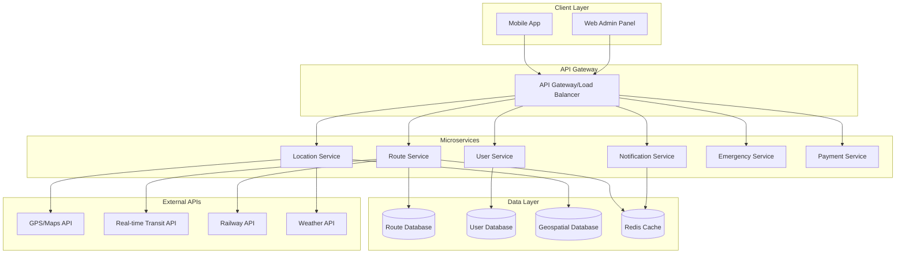

# Design Document: Bhilai Transport & Navigation App

## Overview

The Bhilai Transport & Navigation App is designed as a cross-platform mobile application using a microservices architecture with real-time data processing capabilities. The system integrates multiple transportation data sources, provides offline functionality, and ensures high availability for emergency services.

The application follows a layered architecture pattern with clear separation between presentation, business logic, and data layers. Real-time features are implemented using WebSocket connections and push notifications, while offline functionality is achieved through intelligent caching and local data storage.

## Architecture

### High-Level Architecture



### Technology Stack

**Frontend:**
- React Native for cross-platform mobile development
- Redux for state management
- React Navigation for routing
- MapBox SDK for mapping and navigation
- AsyncStorage for offline data persistence

**Backend:**
- Node.js with Express.js for API services
- Socket.io for real-time communication
- Redis for caching and session management
- PostgreSQL with PostGIS for geospatial data
- MongoDB for user data and preferences

**Infrastructure:**
- Docker containers for microservices
- Nginx as reverse proxy and load balancer
- Firebase Cloud Messaging for push notifications
- AWS S3 for static asset storage

## Components and Interfaces

### Core Components

#### 1. Route Management System
**Purpose:** Handles all transportation route calculations and management

**Key Classes:**
- `RouteCalculator`: Computes optimal routes based on criteria
- `TransportModeManager`: Manages different transportation types
- `FareCalculator`: Calculates costs for different route options
- `RealTimeTracker`: Handles live vehicle tracking

**Interfaces:**
```typescript
interface Route {
  id: string;
  origin: Location;
  destination: Location;
  transportMode: TransportMode;
  estimatedTime: number;
  estimatedCost: number;
  waypoints: Location[];
}

interface RouteOptions {
  optimizeFor: 'time' | 'cost' | 'eco';
  transportModes: TransportMode[];
  includeRealTime: boolean;
}
```

#### 2. Location Services
**Purpose:** Manages GPS tracking, geocoding, and location-based features

**Key Classes:**
- `LocationTracker`: Handles GPS positioning and tracking
- `GeofenceManager`: Manages location-based triggers
- `OfflineMapManager`: Handles offline map data
- `LandmarkService`: Manages points of interest

**Interfaces:**
```typescript
interface Location {
  latitude: number;
  longitude: number;
  accuracy: number;
  timestamp: Date;
}

interface LocationUpdate {
  userId: string;
  location: Location;
  isEmergency: boolean;
}
```

#### 3. User Management System
**Purpose:** Handles user authentication, preferences, and profiles

**Key Classes:**
- `UserAuthenticator`: Manages login and authentication
- `StudentVerifier`: Handles student status verification
- `PreferenceManager`: Manages user settings and preferences
- `AccessibilityManager`: Handles accessibility features

**Interfaces:**
```typescript
interface User {
  id: string;
  email: string;
  phoneNumber: string;
  isStudent: boolean;
  preferences: UserPreferences;
  emergencyContacts: Contact[];
}

interface UserPreferences {
  language: 'en' | 'hi' | 'chhattisgarhi';
  defaultTransportMode: TransportMode;
  accessibilityNeeds: AccessibilityOption[];
}
```

#### 4. Emergency Services System
**Purpose:** Handles emergency features and SOS functionality

**Key Classes:**
- `EmergencyDispatcher`: Manages emergency service coordination
- `SOSHandler`: Handles SOS button functionality
- `LocationSharer`: Manages live location sharing
- `EmergencyContactManager`: Manages emergency contact lists

**Interfaces:**
```typescript
interface EmergencyRequest {
  id: string;
  userId: string;
  type: EmergencyType;
  location: Location;
  timestamp: Date;
  isActive: boolean;
}

interface EmergencyContact {
  name: string;
  phoneNumber: string;
  type: 'police' | 'ambulance' | 'fire' | 'personal';
}
```

#### 5. Real-Time Data Manager
**Purpose:** Handles live data updates and synchronization

**Key Classes:**
- `DataSynchronizer`: Manages data sync between client and server
- `CacheManager`: Handles intelligent caching strategies
- `NotificationManager`: Manages push notifications
- `WebSocketManager`: Handles real-time connections

**Interfaces:**
```typescript
interface RealTimeUpdate {
  type: UpdateType;
  data: any;
  timestamp: Date;
  priority: 'low' | 'medium' | 'high' | 'emergency';
}

interface CacheStrategy {
  ttl: number;
  priority: number;
  syncRequired: boolean;
}
```

## Data Models

### Core Data Structures

#### Transportation Data
```typescript
interface BusRoute {
  id: string;
  routeNumber: string;
  origin: string;
  destination: string;
  stops: BusStop[];
  schedule: Schedule[];
  fare: FareStructure;
  isActive: boolean;
}

interface BusStop {
  id: string;
  name: string;
  location: Location;
  amenities: string[];
  accessibility: AccessibilityFeature[];
}

interface Vehicle {
  id: string;
  type: VehicleType;
  currentLocation: Location;
  capacity: number;
  isAvailable: boolean;
  driverRating: number;
}
```

#### User and Booking Data
```typescript
interface Booking {
  id: string;
  userId: string;
  route: Route;
  status: BookingStatus;
  createdAt: Date;
  scheduledTime: Date;
  actualTime?: Date;
}

interface Rating {
  id: string;
  userId: string;
  targetId: string;
  targetType: 'driver' | 'route' | 'service';
  rating: number;
  comment?: string;
  timestamp: Date;
}
```

#### Geospatial Data
```typescript
interface GeofencedArea {
  id: string;
  name: string;
  polygon: GeoPolygon;
  type: 'school' | 'hospital' | 'landmark' | 'restricted';
  metadata: Record<string, any>;
}

interface TrafficEvent {
  id: string;
  location: Location;
  type: 'closure' | 'accident' | 'construction' | 'event';
  severity: 'low' | 'medium' | 'high';
  startTime: Date;
  endTime?: Date;
  description: string;
}
```

## Error Handling

### Error Categories and Strategies

#### 1. Network and Connectivity Errors
- **Offline Mode Activation**: Automatically switch to cached data when network is unavailable
- **Retry Mechanisms**: Implement exponential backoff for failed API calls
- **Graceful Degradation**: Provide basic functionality even without real-time data

#### 2. GPS and Location Errors
- **Fallback Positioning**: Use network-based location when GPS is unavailable
- **Location Validation**: Verify location accuracy and prompt user if suspicious
- **Manual Location Entry**: Allow users to manually set location when automatic detection fails

#### 3. Data Validation Errors
- **Input Sanitization**: Validate all user inputs before processing
- **Schema Validation**: Ensure data integrity at API boundaries
- **Error Recovery**: Provide clear error messages and recovery options

#### 4. Emergency Service Errors
- **Redundant Systems**: Multiple pathways for emergency service activation
- **Offline Emergency**: Store emergency contacts locally for offline access
- **Failure Notifications**: Alert users if emergency services cannot be reached

### Error Response Format
```typescript
interface ErrorResponse {
  code: string;
  message: string;
  details?: Record<string, any>;
  timestamp: Date;
  requestId: string;
  recoveryActions?: RecoveryAction[];
}

interface RecoveryAction {
  type: 'retry' | 'fallback' | 'manual';
  description: string;
  action: string;
}
```

## Testing Strategy

### Dual Testing Approach

The testing strategy employs both unit testing and property-based testing to ensure comprehensive coverage and correctness validation.

**Unit Testing Focus:**
- Specific user interaction scenarios
- Edge cases and error conditions
- Integration points between services
- Emergency service functionality
- Offline mode behavior

**Property-Based Testing Focus:**
- Route calculation correctness across all inputs
- Data synchronization consistency
- Location tracking accuracy
- Cache invalidation properties
- Real-time update delivery guarantees

### Testing Framework Configuration

**Unit Testing:**
- Jest for JavaScript/TypeScript testing
- React Native Testing Library for component testing
- Supertest for API endpoint testing
- Mock implementations for external services

**Property-Based Testing:**
- fast-check library for JavaScript property testing
- Minimum 100 iterations per property test
- Custom generators for transportation domain objects
- Each property test tagged with: **Feature: bhilai-transport-app, Property {number}: {property_text}**

### Test Environment Setup

**Test Data Management:**
- Synthetic transportation data for consistent testing
- Mock GPS coordinates for Bhilai-Durg-Raipur region
- Simulated real-time events and updates
- Test user accounts with various permission levels

**Performance Testing:**
- Load testing for concurrent user scenarios
- Stress testing for emergency service activation
- Network simulation for offline mode testing
- Battery usage optimization validation

## Correctness Properties

*A property is a characteristic or behavior that should hold true across all valid executions of a system—essentially, a formal statement about what the system should do. Properties serve as the bridge between human-readable specifications and machine-verifiable correctness guarantees.*

### Property Reflection

After analyzing all acceptance criteria, several properties can be consolidated to eliminate redundancy:
- Route information completeness properties (1.2, 1.4, 2.4, 3.4) can be combined into a single comprehensive property
- Real-time notification properties (3.2, 7.1) share similar behavior patterns
- Offline functionality properties (4.4, 9.2, 9.5) can be consolidated
- Data synchronization properties (9.1, 9.4) are complementary aspects of the same behavior

### Core Properties

#### Property 1: Route Search Completeness
*For any* valid origin and destination pair within the service area, the route search should return at least one valid route with complete information including travel time, fare, and waypoints.
**Validates: Requirements 1.1, 1.2, 1.4**

#### Property 2: Real-Time Update Delivery
*For any* real-time event (bus arrival, delay, traffic change), affected users should receive notifications within the specified time threshold (30 seconds for GPS updates, immediate for emergency alerts).
**Validates: Requirements 1.3, 3.2, 7.1, 7.5**

#### Property 3: Fare Calculation Consistency
*For any* route and transport mode combination, fare calculations should be deterministic and within the defined fare structure ranges.
**Validates: Requirements 1.5, 2.5**

#### Property 4: Ride Matching Accuracy
*For any* ride-sharing request, matched users should have overlapping route segments of at least 70% similarity in distance or time.
**Validates: Requirements 2.2**

#### Property 5: Information Display Completeness
*For any* displayed transportation option (driver, route, booking), all required information fields should be present and non-empty (safety ratings, contact info, vehicle details).
**Validates: Requirements 2.3, 2.4, 3.4**

#### Property 6: Navigation Route Options
*For any* navigation request between two points, the system should provide both shortest route and cheapest route options, and these should be mathematically distinct (different in either distance or cost).
**Validates: Requirements 4.1, 4.2**

#### Property 7: Landmark Integration
*For any* route that passes within 500 meters of major landmarks (Civic Center, Maitri Bagh, hospitals, colleges), the route display should highlight these landmarks.
**Validates: Requirements 4.3**

#### Property 8: Offline Functionality Preservation
*For any* core feature (navigation, emergency contacts, cached routes), the functionality should remain available when internet connectivity is unavailable.
**Validates: Requirements 4.4, 9.2, 9.5**

#### Property 9: Emergency Service Activation
*For any* SOS button activation, the system should immediately share GPS location with all configured emergency contacts and maintain sharing until manually deactivated.
**Validates: Requirements 5.2, 5.5**

#### Property 10: Medical Facility Search Completeness
*For any* location-based medical facility search, results should include contact information, distance, and availability status for all facilities within a 10km radius.
**Validates: Requirements 5.3**

#### Property 11: Student Mode Filtering
*For any* user with verified student status, route searches should prioritize educational institution routes and display applicable discounts.
**Validates: Requirements 6.1, 6.3, 6.4**

#### Property 12: Student Verification Integrity
*For any* student verification attempt, the system should accept valid institutional credentials and reject invalid ones with appropriate error messages.
**Validates: Requirements 6.5**

#### Property 13: Event-Based Route Adaptation
*For any* ongoing traffic event (closure, festival, construction), route calculations should avoid affected areas and suggest alternate paths.
**Validates: Requirements 7.2, 7.3**

#### Property 14: Eco-Friendly Option Prioritization
*For any* transportation search, eco-friendly options (cycling, e-rickshaws, electric vehicles) should appear first in results and include carbon footprint information.
**Validates: Requirements 8.1, 8.2, 8.4**

#### Property 15: Eco-Infrastructure Visibility
*For any* location-based search, e-rickshaw stands and charging stations within 2km should be displayed with current availability status.
**Validates: Requirements 8.3**

#### Property 16: Incentive System Consistency
*For any* eco-friendly transportation choice, users should receive appropriate rewards or incentives as defined in the reward structure.
**Validates: Requirements 8.5**

#### Property 17: Data Caching Intelligence
*For any* frequently accessed route (used more than 3 times in 7 days), the route information should be cached locally and available offline.
**Validates: Requirements 9.1**

#### Property 18: Local Data Persistence
*For any* user preference or recent search, the data should persist locally across app sessions and be restored on app restart.
**Validates: Requirements 9.3**

#### Property 19: Data Synchronization Consistency
*For any* cached data that becomes stale, when connectivity is restored, the local data should be updated to match the server state without data loss.
**Validates: Requirements 9.4**

#### Property 20: Performance Response Time
*For any* core function interaction (search, navigation, booking), the system should respond within 2 seconds under normal network conditions.
**Validates: Requirements 10.2**

#### Property 21: Accessibility Feature Availability
*For any* user with accessibility needs, appropriate features (screen reader support, high contrast, voice navigation) should be available and functional.
**Validates: Requirements 10.3**

#### Property 22: Responsive Layout Adaptation
*For any* screen size or orientation change, the interface should adapt appropriately without loss of functionality or information.
**Validates: Requirements 10.5**

### Example-Based Properties

#### Example 1: Emergency Contact Availability
The system should provide one-touch access to ambulance (108), police (100), and fire service (101) contacts.
**Validates: Requirements 5.1**

#### Example 2: Educational Institution Routes
The system should display routes to BIT, DPS, and St. Thomas educational institutions.
**Validates: Requirements 6.2**

#### Example 3: Multi-Language Support
The system should provide complete interface translation in Hindi, English, and Chhattisgarhi languages.
**Validates: Requirements 10.1**

#### Example 4: Standard Fare Chart Display
The system should display fare charts for auto-rickshaws, e-rickshaws, and taxis with current rates.
**Validates: Requirements 2.1**

#### Example 5: Railway Station Integration
The system should display current train schedules for Durg and Bhilai Nagar stations.
**Validates: Requirements 3.1**